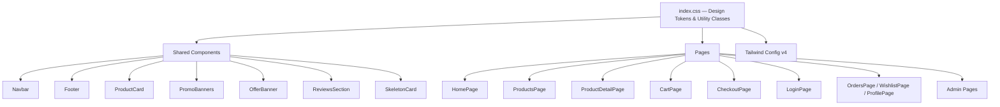
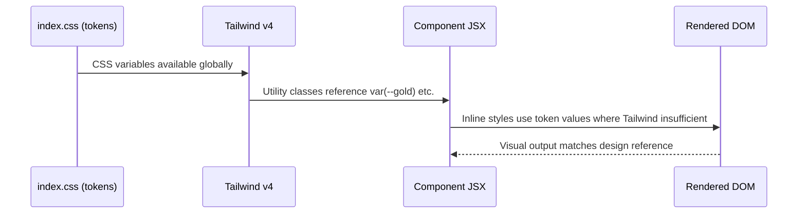

# Design Document: Website Theme Redesign & Full Responsiveness

## Overview

Apply a warm gifting-app theme (FNP/IGP-style pastel palette, card-based grids, horizontal carousels, bold typography) across every page and component of the Vidyarathi React + Vite e-commerce site, and ensure the layout is fully responsive across mobile (320–767px), tablet (768–1023px), and desktop (1024px+).

The site already has a solid warm-luxury CSS foundation in `index.css` (CSS custom properties, utility classes, Inter + Playfair Display fonts, gold `#C8A23A` accent). The redesign standardises deviating components—`ReviewsSection` (blue palette), `PromoBanners` (dark gradients), and various page-level inline styles—onto the shared token system, adds mobile-first responsive rules, and introduces the carousel/scroll patterns from the reference design.

---

## Architecture



---

## Design Token System (`src/index.css`)

All color, spacing, and typography values flow from CSS custom properties. No component should use raw hex values that conflict with the token set.

```css
:root {
  /* Backgrounds — warm pastel ivory */
  --bg:           #F8F5F0;   /* page background */
  --bg-alt:       #F3EEE6;   /* alternate section background */
  --bg-card:      #FFFFFF;   /* card surface */
  --bg-footer:    #2C241B;   /* footer dark */

  /* Text */
  --ink:          #2C241B;   /* primary text */
  --ink-2:        #6F655A;   /* secondary text */
  --ink-3:        #8F857A;   /* muted / caption */

  /* Brand Gold */
  --gold:         #C8A23A;
  --gold-dark:    #A88422;
  --gold-gradient: linear-gradient(135deg, #D4AF37, #B8860B);

  /* Accent Pastels (gifting theme) */
  --peach:        #FDDCB5;   /* soft orange/peach highlight */
  --blush:        #F9C8C8;   /* soft pink highlight */
  --cream:        #FFF8ED;   /* warm cream */

  /* Borders */
  --border:       #E7DED1;
  --border-gold:  rgba(200,162,58,0.28);

  /* States */
  --success:      #2E7D32;
  --danger:       #D9534F;

  /* Spacing */
  --section-gap:  120px;
  --container:    1280px;

  /* Responsive breakpoints (reference only) */
  /* --bp-sm: 640px  --bp-md: 768px  --bp-lg: 1024px  --bp-xl: 1280px */
}
```

---

## Architecture — Sequence: Theme Token Inheritance



---

## Components and Interfaces

### Component: `OfferBanner`

**Current state:** Uses `bg-gradient-to-r from-[#B8960C] via-[#D4AF37]` — already on-theme.
**Change:** Wrap in CSS token; ensure text is legible at all widths; dots sit above 320px.

```typescript
interface OfferBannerProps {}  // no props — reads from Supabase settings

// Responsive rules
// mobile  (< 640px): text truncated at max-w-[220px], font-size 11px
// tablet  (640–1023px): max-w-lg, font-size 13px
// desktop (≥ 1024px): max-w-2xl, font-size 14px
```

### Component: `Navbar`

**Current state:** Sticky, 80px height, warm `#F8F5F0` background — mostly on-theme.
**Changes needed:**
- Mobile hamburger drawer: already exists; confirm no horizontal overflow at 320px.
- Bottom mobile nav bar (new, FNP-style): Home / Categories / Cart / Profile — 4 icons.
- `lg:hidden` bottom bar sits at `z-50`, `position: fixed`, `bottom: 0`.

```typescript
interface BottomNavItem {
  icon: ReactNode
  label: string
  to: string
  badge?: number  // cart count
}

// Bottom nav only renders on viewport < 1024px
// Height: 60px, background: #FFFFFF, border-top: 1px solid #E7DED1
// Safe area inset: padding-bottom: env(safe-area-inset-bottom, 0px)
```

### Component: `ProductCard`

**Current state:** `card-lux` class, gold hover, correct token colors.
**Changes needed:**
- Ensure `aspect-ratio: 1` image never causes overflow at 160px min width (2-col on 320px screen).
- Touch-friendly hover actions: on mobile, show Personalise button always (not on hover only).
- Label truncation at small sizes: max 2 lines.

```typescript
interface ProductCardProps {
  product: {
    id: string
    name: string
    category: string
    price: number
    compare_price?: number
    images?: string[]
    stock: number
    is_featured?: boolean
  }
}

// Responsive card widths:
// 2-col grid  (< 640px):  minWidth ~160px
// 3-col grid  (640–1023px): minWidth ~220px
// 4-col grid  (≥ 1024px):  minWidth ~280px
```

### Component: `PromoBanners`

**Current state:** Dark gradient backgrounds (`from-[#004d40]`, `from-[#0a001a]`), conflicts with warm pastel theme.
**Change:** Replace dark gradients with warm pastel variants aligned to the gifting reference.

```typescript
// New banner background palette (replace dark gradients):
const PASTEL_GRADIENTS = [
  "from-[#FFF0E0] to-[#FFD9A8]",   // warm peach
  "from-[#FDE8F0] to-[#F9C8D8]",   // soft blush
  "from-[#FFF8E1] to-[#FFE082]",   // sunny yellow
  "from-[#E8F5E9] to-[#C8E6C9]",   // mint green
]

// Text on pastel bg: --ink (#2C241B) instead of white
// Accent color per banner: use --gold (#C8A23A) or brand-matching tone
// Image border: border-[--border-gold]
// CTA button: btn-primary (gold gradient)
```

**Responsive:**
```typescript
// Mobile (< 640px): stack image below text; min-height 160px
// Tablet+: side-by-side; image 40% width; min-height 170px
```

### Component: `ReviewsSection`

**Current state:** Uses blue palette `#1B2B5E`, `#1A1A2E`, `#C9956C` — does not match warm theme.
**Change:** Migrate entirely to warm token system.

```typescript
// Color replacements:
// #1B2B5E  → var(--gold)      (primary action buttons)
// #2A3F7E  → var(--gold-dark) (hover state)
// #1A1A2E  → var(--ink)       (headings)
// #4A4A6A  → var(--ink-2)     (body text)
// #8A8AAA  → var(--ink-3)     (muted text)
// #C9956C  → var(--gold)      (star color, eyebrow)
// #FAF8F5  → var(--bg-alt)    (form background)
// #E8E0D5  → var(--border)    (borders)

// StarRating: fill-[--gold] instead of fill-[#C9956C]
// Buttons: use .btn-primary / .btn-ghost utility classes
// Review card: use .card-lux class
// Avatar initials bg: rgba(200,162,58,0.12) border rgba(200,162,58,0.25)
```

### Component: `Footer`

**Current state:** Dark `#2C241B` background — on-theme, good.
**Changes:** Minor responsive: on mobile collapse link columns into accordion or 2-col grid.

```typescript
// Mobile (< 768px): grid-cols-2 for link columns
// Newsletter input: full-width stacked on < 480px
```

---

## Data Models

### Theme Token Map

```typescript
type CSSTokenKey =
  | "--bg" | "--bg-alt" | "--bg-card" | "--bg-footer"
  | "--ink" | "--ink-2" | "--ink-3"
  | "--gold" | "--gold-dark" | "--gold-gradient"
  | "--peach" | "--blush" | "--cream"
  | "--border" | "--border-gold"
  | "--success" | "--danger"

type TokenValue = string  // hex, rgba, or CSS gradient string

type DesignTokenMap = Record<CSSTokenKey, TokenValue>
```

### Responsive Breakpoint Model

```typescript
type Breakpoint = "xs" | "sm" | "md" | "lg" | "xl"

interface BreakpointSpec {
  minWidth: number   // px
  containerPadding: number  // px each side
  gridCols: {
    products: number
    categories: number
  }
  fontScale: number  // multiplier on clamp base
}

const BREAKPOINTS: Record<Breakpoint, BreakpointSpec> = {
  xs:  { minWidth: 0,    containerPadding: 16, gridCols: { products: 2, categories: 2 }, fontScale: 0.88 },
  sm:  { minWidth: 640,  containerPadding: 24, gridCols: { products: 3, categories: 3 }, fontScale: 1.0  },
  md:  { minWidth: 768,  containerPadding: 32, gridCols: { products: 3, categories: 4 }, fontScale: 1.0  },
  lg:  { minWidth: 1024, containerPadding: 48, gridCols: { products: 4, categories: 4 }, fontScale: 1.0  },
  xl:  { minWidth: 1280, containerPadding: 64, gridCols: { products: 4, categories: 8 }, fontScale: 1.0  },
}
```

### Banner Data Model (updated for warm theme)

```typescript
interface PromoBanner {
  id: number
  badge: string          // e.g. "LIMITED TIME"
  title: string
  subtitle: string
  desc?: string
  price?: string
  originalPrice?: string
  cta: string
  link: string
  bgClass: string        // Tailwind gradient class — MUST be a pastel variant
  accentColor: string    // hex — used for badge, price highlight, border
  textColor: string      // "#2C241B" for pastel bgs (not white)
  image?: string
}
```

---

## Key Functions with Formal Specifications

### Function: `applyWarmTheme(component)`

Converts any component using off-palette colors to the warm token system.

```typescript
function applyWarmTheme(componentStyles: StyleMap): StyleMap
```

**Preconditions:**
- `componentStyles` is a non-empty object of CSS property → value pairs
- All target components are identified (ReviewsSection, PromoBanners, any remaining blue)

**Postconditions:**
- No value in result references `#1B2B5E`, `#1A1A2E`, `#004d40`, `#0a001a` or similar cool/dark palette colors
- All colors resolve to warm token values or their `rgba()` equivalents
- Text contrast ratio on each background meets WCAG AA (≥ 4.5:1)

**Loop Invariants (color replacement loop):**
- For each replaced color: the replacement is drawn from `DesignTokenMap`
- Interactive states (hover, focus) are updated in parallel with their base color

---

### Function: `makeResponsive(selector, rules)`

Injects breakpoint-aware CSS rules for a given selector.

```typescript
function makeResponsive(
  selector: string,
  rules: Partial<Record<Breakpoint, CSSProperties>>
): string  // returns CSS string
```

**Preconditions:**
- `selector` is a valid CSS selector string
- `rules` contains at least one breakpoint entry

**Postconditions:**
- Output contains a media query for every key in `rules`
- Mobile-first order: smallest breakpoint rules appear first (no `max-width` queries)
- No layout overflow at any breakpoint between 320px and 1440px

**Loop Invariants:**
- Each breakpoint rule is complete (all required properties present) before moving to next

---

### Function: `renderProductGrid(products, breakpoint)`

Determines the correct column count and card size for the product grid.

```typescript
function renderProductGrid(
  products: Product[],
  breakpoint: Breakpoint
): { cols: number; cardMinWidth: number; gap: number }
```

**Preconditions:**
- `products` array is non-empty
- `breakpoint` is a valid `Breakpoint` key

**Postconditions:**
- `cols` matches `BREAKPOINTS[breakpoint].gridCols.products`
- `cardMinWidth * cols + gap * (cols - 1) ≤ containerWidth`
- No horizontal scroll introduced

---

### Function: `HorizontalScrollCarousel({ items, renderItem })`

Renders a touch-scrollable horizontal row of cards (category chips, best-seller mini-cards).

```typescript
function HorizontalScrollCarousel<T>({
  items,
  renderItem,
  showDots,
}: {
  items: T[]
  renderItem: (item: T, index: number) => ReactNode
  showDots?: boolean
}): JSX.Element
```

**Preconditions:**
- `items.length >= 1`
- `renderItem` returns a valid React node

**Postconditions:**
- Scrollbar hidden on all browsers (`::-webkit-scrollbar { display:none }`, `scrollbar-width: none`)
- Scroll snaps to card boundaries on touch (CSS `scroll-snap-type: x mandatory`)
- Dot indicators (if `showDots`) update `currentIndex` on scroll via `IntersectionObserver`
- No layout reflow when scrolling (use `will-change: transform` on track)

---

## Algorithmic Pseudocode

### Main Theme Migration Algorithm

```pascal
ALGORITHM migrateComponentToWarmTheme(component)
INPUT: component — React component file path
OUTPUT: updated component with warm token colors

BEGIN
  source ← readFile(component)
  
  // Step 1: Identify all color literals
  colorLiterals ← extractHexValues(source)
  
  // Step 2: Classify each color
  FOR each color IN colorLiterals DO
    ASSERT isValidHexColor(color)
    
    IF isOffPaletteCool(color) THEN
      replacement ← TOKEN_MAP[color] OR nearestWarmToken(color)
      source ← replaceAll(source, color, replacement)
    END IF
    
    IF isOffPaletteDarkGradient(color) THEN
      replacement ← nearestPastelGradient(color)
      source ← replaceAll(source, color, replacement)
    END IF
  END FOR
  
  // Step 3: Replace class-level dark gradients in PromoBanners
  IF component = "PromoBanners" THEN
    source ← replaceDarkGradients(source, PASTEL_GRADIENTS)
    source ← updateTextColors(source, "#2C241B")  // dark text on light bg
  END IF
  
  // Step 4: Validate contrast
  FOR each (bgColor, textColor) IN extractColorPairs(source) DO
    ratio ← contrastRatio(bgColor, textColor)
    ASSERT ratio >= 4.5  // WCAG AA
  END FOR
  
  writeFile(component, source)
  RETURN source
END
```

**Preconditions:** Component file exists and is valid JSX/TSX
**Postconditions:** No cool-palette hex values remain; contrast ≥ 4.5:1 on all text/bg pairs
**Loop Invariant:** Each processed color replacement preserves semantic role (primary, muted, accent)

---

### Responsive Layout Algorithm

```pascal
ALGORITHM applyResponsiveGrid(page)
INPUT: page — page component name
OUTPUT: CSS grid rules for 4 breakpoints

BEGIN
  gridConfig ← BREAKPOINTS[page]
  
  // Mobile-first: base styles (no media query)
  baseCSS ← buildGrid(cols=2, gap=12, padding=16)
  
  // Progressive enhancement
  FOR each bp IN [sm, md, lg, xl] DO
    ASSERT bp.minWidth > previousBp.minWidth
    
    bpCSS ← buildGrid(
      cols    = gridConfig[bp].cols,
      gap     = gridConfig[bp].gap,
      padding = gridConfig[bp].containerPadding
    )
    
    media ← "@media (min-width: " + bp.minWidth + "px) { " + bpCSS + " }"
    append(outputCSS, media)
  END FOR
  
  ASSERT noHorizontalOverflow(outputCSS, viewportRange=[320, 1440])
  
  RETURN outputCSS
END
```

**Loop Invariant:** Each breakpoint rule overrides only the properties that need to change; inherited base rules remain valid

---

### Bottom Navigation Render Algorithm

```pascal
ALGORITHM renderBottomNav(currentPath, cartCount)
INPUT: currentPath — current React Router pathname
       cartCount   — number of items in cart
OUTPUT: Bottom nav bar JSX (mobile only)

BEGIN
  ASSERT currentPath IS string
  ASSERT cartCount >= 0
  
  navItems ← [
    { icon: Home,         label: "Home",       to: "/" },
    { icon: Grid,         label: "Categories", to: "/products" },
    { icon: ShoppingCart, label: "Cart",        to: "/cart", badge: cartCount },
    { icon: User,         label: "Account",    to: user ? "/profile" : "/login" },
  ]
  
  FOR each item IN navItems DO
    isActive ← matchPath(currentPath, item.to)
    iconColor ← IF isActive THEN var(--gold) ELSE var(--ink-3)
    labelColor ← IF isActive THEN var(--gold) ELSE var(--ink-3)
    
    IF item.badge > 0 THEN
      render BadgeIcon(item.icon, item.badge)
    ELSE
      render item.icon
    END IF
  END FOR
  
  RETURN <nav className="lg:hidden fixed bottom-0 inset-x-0 z-50 ..."> ... </nav>
END
```

**Preconditions:** `currentPath` is a valid route string; `cartCount ≥ 0`
**Postconditions:** Exactly 4 nav items rendered; active item highlighted with `--gold`; `z-50` ensures it overlays content

---

## Example Usage

### Adding New Pastel Banner

```typescript
// In PromoBanners.jsx DEFAULT_BANNERS array:
const DEFAULT_BANNERS = [
  {
    id: 1,
    badge: "LIMITED TIME",
    title: "Custom Photo Gifts",
    subtitle: "Up to 30% Off",
    desc: "Personalized mugs, frames & more",
    price: "349",
    originalPrice: "499",
    cta: "Shop Now",
    link: "/products?category=Mugs",
    // CHANGED: warm pastel instead of dark gradient
    bgClass: "from-[#FFF0E0] to-[#FFD9A8]",
    accentColor: "#C8A23A",
    textColor: "#2C241B",   // dark text on light background
    image: "https://images.unsplash.com/photo-1514228742587-6b1558fcca3d?w=300&q=80"
  },
  // ...
]
```

### HorizontalScrollCarousel Usage (Best Sellers section)

```typescript
// In HomePage.jsx, replace fixed-width overflow scroll with:
<HorizontalScrollCarousel
  items={bestSellers}
  showDots={true}
  renderItem={(product, i) => (
    <div key={product.id} className="snap-start flex-shrink-0 w-56 sm:w-64">
      <MiniCard product={product} />
    </div>
  )}
/>
```

### ReviewsSection — Updated Button

```typescript
// BEFORE (blue):
<button className="px-6 py-2.5 bg-[#1B2B5E] text-white font-semibold rounded-lg hover:bg-[#2A3F7E]">
  Write a Review
</button>

// AFTER (warm gold):
<button className="btn-primary" style={{ height: 44, padding: "0 24px", fontSize: 13 }}>
  Write a Review
</button>
```

### Responsive Bottom Nav Addition to App.jsx

```typescript
// In App.jsx storefront route wrapper, add below <Footer />:
import BottomNav from './components/BottomNav'

// Inside the storefront <div>:
<Footer />
<BottomNav />  {/* renders null on lg+ via lg:hidden */}

// BottomNav adds padding-bottom: 60px to main on mobile so content
// isn't hidden behind the fixed bar:
<main className="flex-1 pb-[60px] lg:pb-0">
```

---

## Correctness Properties

### Property 1: Banner contrast

For all pastel banner backgrounds: text contrast ratio ≥ 4.5:1 (WCAG AA). Dark text `#2C241B` on light pastel backgrounds always satisfies this threshold.

**Validates: Requirements 1.1**

### Property 2: No horizontal overflow

For all viewports 320px–1440px: `document.body.scrollWidth === window.innerWidth`. No component introduces a fixed-width element wider than the viewport.

**Validates: Requirements 2.1**

### Property 3: Grid column bounds

For all product grid pages: `gridCols ∈ {2, 3, 4}` depending on viewport breakpoint; never 1 or 5+. The column count is derived purely from `BREAKPOINTS[bp].gridCols.products`.

**Validates: Requirements 2.2**

### Property 4: Bottom nav visibility

For bottom nav: visible only when `window.innerWidth < 1024` (`lg:hidden` Tailwind class). On desktop the nav is not rendered at all, preventing layout interference.

**Validates: Requirements 2.3**

### Property 5: Color token adherence

For every component post-migration: no CSS color value outside the warm token palette (`#F8F5F0`/`#F3EEE6`/`#FAF8F3` backgrounds, `#2C241B`/`#6F655A`/`#8F857A` text, `#C8A23A`/`#A88422` gold, `#E7DED1` border, `#2E7D32` success, `#D9534F` danger).

**Validates: Requirements 1.2**

### Property 6: Carousel scroll consistency

For `HorizontalScrollCarousel`: `scrollLeft` changes monotonically on swipe in the swipe direction; `currentDotIndex` always stays within `[0, items.length - 1]` and matches the most-visible card.

**Validates: Requirements 1.3**

---

## Error Handling

### Off-Palette Color Detected

**Condition:** A component uses a hex color outside the token system (e.g., `#1B2B5E`)
**Response:** Replace with nearest semantic token; document the mapping in code comment
**Recovery:** Visual regression test catches remaining outliers via snapshot diff

### Overflow at Narrow Viewport

**Condition:** A component causes `scrollWidth > clientWidth` at 320px
**Response:** Add `overflow-x: hidden` at the offending container; audit fixed-width values
**Recovery:** Add explicit max-width constraints; prefer `min()` / `clamp()` over fixed px

### Bottom Nav Overlap

**Condition:** Fixed bottom nav covers page content on mobile
**Response:** `main` element receives `padding-bottom: 60px` (nav height) on screens `< 1024px`
**Recovery:** If safe-area inset (iPhone notch) applies, use `env(safe-area-inset-bottom)` addition

### Admin Panel Bleed

**Condition:** Admin routes inherit storefront theme changes unintentionally
**Response:** Admin routes use `AdminLayout` (separate from storefront `<div>` wrapper); theme tokens apply but admin-specific blue accents are preserved in admin-only CSS scope
**Recovery:** Scope storefront-only overrides under `.storefront` class on the root div

---

## Testing Strategy

### Unit Testing Approach

Test utility functions (color replacement, contrast ratio calculation, responsive grid config lookup) in isolation using Vitest:

```typescript
// contrast ratio utility
test('warm token text on --bg-alt meets WCAG AA', () => {
  expect(contrastRatio('#2C241B', '#F3EEE6')).toBeGreaterThanOrEqual(4.5)
})

// grid column resolver
test('returns 2 cols at xs breakpoint', () => {
  expect(getGridCols('products', 'xs')).toBe(2)
})
```

### Property-Based Testing Approach

**Property Test Library:** fast-check

```typescript
import fc from 'fast-check'

// Property: no viewport width causes horizontal scroll
test('layout is overflow-free at any viewport width', () => {
  fc.assert(
    fc.property(
      fc.integer({ min: 320, max: 1440 }),
      (width) => {
        // Render component at given width
        // Assert scrollWidth <= clientWidth
        return renderAtWidth(width).scrollWidth <= width
      }
    )
  )
})

// Property: pastel banner text is always legible
test('all banner text/bg pairs meet contrast threshold', () => {
  fc.assert(
    fc.property(
      fc.constantFrom(...PASTEL_GRADIENTS),
      fc.constantFrom('#2C241B', '#6F655A'),
      (bgClass, textColor) => {
        return contrastRatio(extractBgColor(bgClass), textColor) >= 4.5
      }
    )
  )
})
```

### Integration Testing Approach

Manual browser testing at three viewport sizes (375px iPhone SE, 768px iPad, 1440px desktop) checking:
- No horizontal scroll at any breakpoint
- Bottom nav visible on mobile, hidden on desktop
- All cards render with correct column counts
- Pastel banners render warm (not dark)
- ReviewsSection stars are gold, buttons are gold

---

## Performance Considerations

- All image-heavy carousels use `loading="lazy"` on `` tags (already in place via ProductCard)
- `HorizontalScrollCarousel` uses CSS scroll snap — no JS-driven position calculation during scroll
- Bottom nav uses `position: fixed` — does not cause reflow on scroll
- Token changes are CSS-only; no runtime JS overhead
- `will-change: transform` added to carousel track to promote to GPU composite layer
- Framer Motion `AnimatePresence` already in use; keep existing usage pattern

---

## Security Considerations

- No user-generated content is rendered as raw HTML; all product names / review text go through React's JSX rendering (XSS-safe)
- Custom photo uploads (ProductDetailPage) are validated client-side: max 10MB, `image/*` MIME type only — this is already implemented
- Admin panel routes remain behind `AdminRoute` guard; theme changes do not alter auth logic

---

## Dependencies

All existing; no new packages required:

| Package | Version | Role |
|---|---|---|
| `tailwindcss` | ^4.2.4 | Utility classes, responsive prefixes |
| `framer-motion` | ^12.38.0 | Carousel animations, banner transitions |
| `lucide-react` | ^1.14.0 | Icons (Bottom Nav, cards) |
| `react-router-dom` | ^7.14.2 | Route-aware bottom nav active state |

New file to create:
- `src/components/BottomNav.jsx` — mobile bottom navigation bar
- `src/components/HorizontalScrollCarousel.jsx` — reusable touch-scroll row

Files to modify:
- `src/index.css` — add `--peach`, `--blush`, `--cream` tokens; add `.bottom-nav-spacer` utility
- `src/components/PromoBanners.jsx` — replace dark gradient configs with pastel variants
- `src/components/ReviewsSection.jsx` — migrate blue palette to warm tokens
- `src/App.jsx` — add `<BottomNav />`, add `pb-[60px] lg:pb-0` to main
- `src/pages/HomePage.jsx` — wrap best-sellers in `HorizontalScrollCarousel`
